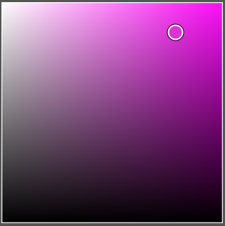
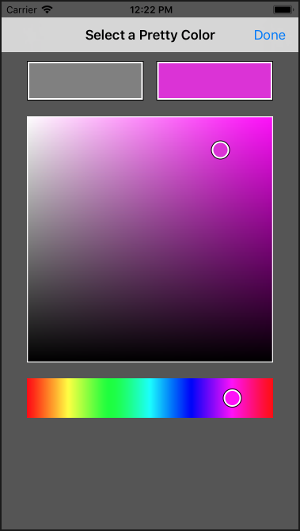
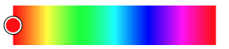
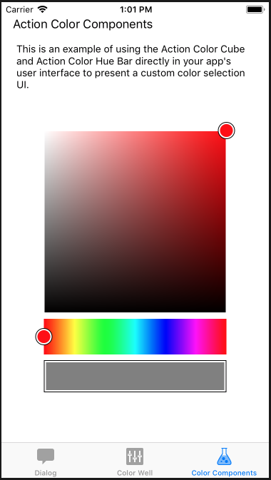
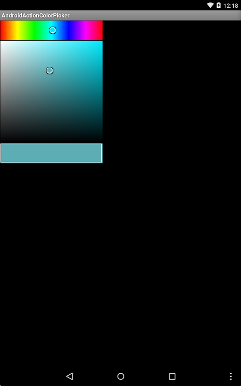

# About Action Color Picker

**Action Color Picker** provides a highly customizable, cross platform graphical color selection system for iOS and Android. With **Action Color Picker** you can present the user with the currently selected color, allow them to select the desired hue, then change the saturation and brightness of that hue, all with a minimum of code.  

**Action Color Picker** provides functions to move easily between the HSV, RGB and native `UIColor` (iOS) and `Color` (Android) spaces. In many cases the same code used to work with an **Action Color Picker** on one platform can be used virtually unchanged on another which not only saves time, but improves code maintainability.

# Running the Samples

Before you can successfully build and run these sample apps, you'll need to download and install the [Action Components Trial](http://appracatappra.com/products/action-components/) version from the Appracatappra website or have purchased and installed a licensed version of the components.

Next, open either the iOS or the Android version of the sample in Visual Studio and expand the **Resources** folder:


If the `ActionComponents` entry is grayed-out with a red X (as shown in the image above), right-click on it and select **Delete**. Double-Click the **Resources** folder to open the **Edit References** dialog and select the **.Net Assembly** tab:


Click the **Browse** button, navigate to where you installed the **Action Components** trial or licensed version and locate the appropriate `ActionComponents.ddl` (for either iOS or Android) and click the **OK** button. The sample will now be ready to run.

# The Action Color Picker Suite

The **Action Color Picker** is actually a suite of several individual components that can be added to your iOS or Android apps to provide a wide range of color selection interfaces. Because of this flexibility, you can use the individual components of the suite to tailor the color selection UI to your app's look and feel.

The following sections will define the individual components of the **Action Color Picker** and how they can be used within your apps.

## ACColorCube (iOS/Android)

The **Action Color Cube** displays a color selection cube in the app's user interface that allows the user to move a pointer around to select the `Saturation` and `Brightness` of a color `Hue`. For example:



This control is typically used with an **Action Hue Bar** (`ACHueBar`) to select the initial color `Hue`. When added to an app's UI, the `ACColorCube` needs to be set to 256 pixels wide by 256 pixels high.

### Properties

**Action Color Cube** defines the following properties:

* `Hue` - Sets the color hue as a number between 0 and 1.
* `Saturation` - Gets or sets the color saturation as a number between 0 and 1.
* `Brightness` - Gets or sets the color brightness as a number between 0 and 1.
* `HSV` - Gets the current color as a `HSVColor` object.

### Events

**Action Color Cube** defines the following events that you can monitor and respond to:

* `ColorChanged`

## ACColorPickerViewController (iOS Only)

The **Action Color Picker View Controller** creates a color selection dialog box that fully handles the process of showing a currently selected color and allowing the user the select a new color. For Example:



It can be called at any point in an iOS app to allow the user to select a new color. For example:

```csharp
// Create picker
var picker = new ACColorPickerViewController();
picker.Title = "Select a Pretty Color";
picker.Color = colorWell.Color;

// Wireup events
picker.SelectionFinished += (color) => {
	DismissViewController(true, null);
	colorWell.Color = color;
};

// Display
PresentViewController(picker, true, null);
```

### Properties

**Action Color Picker View Controller** defines the following properties:

* `Title` - Gets or sets the title that is displayed at the top of the color selection dialog.
* `Color` - Gets or sets the currently selected color.

### Events

**Action Color Picker View Controller** defines the following events that you can monitor and respond to:

* `SelectionFinished`

## ACColorWell (iOS/Android)

The **Action Color Well** displays a framed color well that shows the currently selected color and allows the user to tap the well which raises the `Touched` event. For example:


The `ACColorWell` is typically used along with the `ACHueBar` and `ACColorCube` controls and can be any size inside of the UI.

### Properties

**Action Color Well** defines the following properties:

* `Color` (iOS) / `CurrentColor` (Android) - Gets or sets the color currently displayed.
* `AutoPresentHSBColorPicker` (iOS Only) - If `true` a **Action Color Picker View Controller** will automatically be presented to change the color when the user taps the **Action Color Well**.
* `ColorPickerTitle` (iOS Only) - Sets the title displayed in the **Action Color Picker View Controller**.
* `ParentViewController` (iOS Only) - Sets the parent View Controller for the **Action Color Well**. NOTE: This property must be set for the automatic **Action Color Picker View Controller** to work.

### Events

**Action Color Well** defines the following events that you can monitor and respond to:

* `Touched`
* `ColorChanged` (iOS Only)

## ACHueBar (iOS/Android)

The **Action Color Hue Bar** presents a hue selection bar to the user that they can interact with to select the current color. For example:



The `ACHueBar` is typically used with the `ACColorCube` and `ACColorWell` to form a fully color setting UI. When added to an app's UI, the `ACHueBar` needs to be set to 256 pixels wide by 50 pixels high. 

### Properties

**Action Color Hue Bar** defines the following properties:

* `Hue` - Gets or sets the color hue as a number between 0 and 1.

### Events

**Action Color Hue Bar** defines the following events that you can monitor and respond to:

* `HueChanged`

## HSVColor (iOS/Android)

Defines a color as its `Hue`, `Saturation` and `Value` properties and contains utilities to move the color to and from other color spaces such as `UIColor` (iOS) or `Color` (Android).

### Properties

`HSVColor` defines the following properties:

* `Hue` - The color hue as a number between 0 and 360.
* `Saturation` - The color saturation as a number between 0 and 1.
* `Value` The color brightness as a number between 0 and 1.
* `RGB` - Gets or sets the color as a `RGBColor` object.
* `Color` (iOS)/ `RawColor` (Android) - Gets or sets the color as `UIColor` (iOS) or `Color` (Android).

### Methods

`HSVColor` defines the following methods:

* `ToRGB` - Returns the color as a `RGBColor` object.
* `FromRGB` - Sets the color from a `RGBColor` object.
* `ToUIColor` (iOS Only) - Returns the color as a `UIColor`.
* `ToRawColor` (Android Only) - Returns the color as a `Color`.
* `FromUIColor` (iOS Only) - Sets the color from a `UIColor`.
* `FromRawColor` (Android Only) - Sets the color from a `Color`.

## HSVImage (iOS/Android)

The `HSVImage` class creates the HSV images to present in the `ACColorCube` and `ACHueBar` based on the current `Hue`, `Saturation` and `Value` properties.

### Static Methods

`HSVImage ` defines the following methods:

* `Pin` - Ensures a given color value is within a given range of acceptable values.
* `Blend` - Combines two color elements and returns the resulting color combination.
* `CreateBGRxImageContext` (iOS Only) - Creates a background RX image context.
* `SaturationBrightnessSquareImage` - Returns the brightness and saturation image for the given hue.
* `HueBarImage` - Returns the hue selection image for the given `ACHueBarComponentIndex` and `HSVColor`.

## RGBColor (iOS/Android)

Represents a color based on its Red, Green and Blue properties and contains the properties and methods to convert the color to a different color space, such as `UIColor` (iOS) or `Color` (Android).

### Properties

`RGBColor` defines the following properties:

* `Red` - The red element of the color as a number between 0 and 1.
* `Green` - The green element of the color as a number between 0 and 1.
* `Value` The color brightness as a number between 0 and 1.
* `HSV` - Gets or sets the color as a `HSVColor` object.
* `Color` (iOS)/ `RawColor` (Android) - Gets or sets the color as `UIColor` (iOS) or `Color` (Android).

### Methods

`RGBColor` defines the following methods:

* `ToHSV` - Returns the color as a `HSVColor` object.
* `FromHSV` - Sets the color from a `HSVColor` object.
* `ToUIColor` (iOS Only) - Returns the color as a `UIColor`.
* `ToRawColor` (Android Only) - Returns the color as a `Color`.
* `FromUIColor` (iOS Only) - Sets the color from a `UIColor`.
* `FromRawColor` (Android Only) - Sets the color from a `Color`.


# iOS Example

The following is an example of work with the individual **Action Color Picker** components added to the `main.storyboard` file of an iOS app:

```csharp
using ActionComponents;
…

// Wireup the color bar
hueBar.HueChanged += (hue) => {
	// Set new cube hue
	colorCube.Hue = hue;
	Console.WriteLine(hue);
};

// Wireup color cube
colorCube.ColorChanged += (color) => {
	colorWell.Color = color;
};
```



# Android Examples

The following is an example of work with the individual **Action Color Picker** components added to the `main.axml` file of an Android app:

```csharp
using Android.App;
using Android.Widget;
using Android.OS;
using ActionComponents;

namespace AndroidActionColorPicker
{
	[Activity(Label = "AndroidActionColorPicker", MainLauncher = true, Icon = "@mipmap/icon")]
	public class MainActivity : Activity
	{

		protected override void OnCreate(Bundle savedInstanceState)
		{
			base.OnCreate(savedInstanceState);

			// Set our view from the "main" layout resource
			SetContentView(Resource.Layout.Main);

			// Testing
			var hueBar = FindViewById<ACHueBar>(Resource.Id.hueBar);
			var colorCube = FindViewById<ACColorCube>(Resource.Id.colorCube);
			var colorWell = FindViewById<ACColorWell>(Resource.Id.colorWell);

			// Wireup the color bar
			hueBar.HueChanged += (hue) => {
				// Set new cube hue
				colorCube.Hue = hue;
			};

			// Wireup color cube
			colorCube.ColorChanged += (color) => {
				colorWell.CurrentColor = color;
			};
		}
	}
}
```



# Trial Version

The Trial version of **Action Color Picker** is fully functional but includes a `Toast` style popup. The fully licensed version removes this popup.
